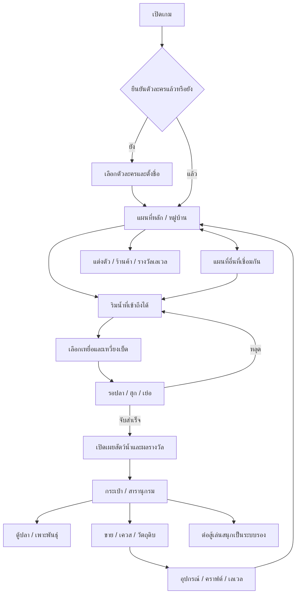

# แผนผังและแนวทางเกม

อัปเดต 4 กันยายน 2026 · อ่านสถานะโค้ดจริงประกอบใน [HANDOFF.md](HANDOFF.md)

## เป้าหมายและรสนิยมที่ตกลงกัน

- เกมตกปลาและสำรวจเป็นแกนหลัก เล่นบนเว็บมือถือแนวนอน และทดสอบด้วยคอมได้
- ภาพสดใส น่ารัก เหมาะกับเด็ก ฟอนต์ไทยอ่านง่าย ปุ่มและการ์ดใช้ธีมเดียวกันทุกหน้า
- หน้าหลักเป็นพื้นที่เดินสำรวจ มีไอคอนเมนูบนจอ ไม่เพิ่มหน้ารวมเมนูซ้ำซ้อน
- อิงสัตว์น้ำจริง รวมปลา กุ้ง ปู หอย; วางแผนเพิ่มสัตว์สูญพันธุ์เพื่อการเรียนรู้
- ผู้ใช้เคยอนุมัติการยกเครื่องภาพโดยคงระบบเกม แต่ภาพใหม่ต้องตรวจร่วมกับหน้าจอจริงก่อนสรุปว่าสวยหรือเสร็จ
- เกมอ้างอิง: https://game.fishbonecast.com/play ใช้ศึกษาแนวทาง ไม่ถือเป็นแบบที่ต้องทำเหมือนทุกจุด

## แผนผังประสบการณ์เป้าหมาย

แผนผังนี้แสดงความเชื่อมโยงของระบบเป้าหมาย ไม่ได้ยืนยันว่าทุกปุ่มหรือทุกเส้นทางถูกต่อครบแล้ว

## ข้อกำหนดหลักจากผู้ใช้

### สำรวจและแผนที่

- หลายพื้นที่เชื่อมกัน เดินชนจุดเปลี่ยนแผนที่แล้วเปลี่ยนอัตโนมัติ
- น้ำ บ้าน หิน รั้ว เป็นสิ่งกีดขวางจริง เดินขึ้นสะพานได้แต่ห้ามเดินออกข้างสะพานลงน้ำ
- เส้นทางไป NPC ต้องเข้าถึงได้ โดยเฉพาะลุงมนัส
- ไม่ใช้จุดตกปลาแบบป้ายตายตัว: ริมน้ำที่ตัวละครเข้าถึงได้ควรตกปลาได้ ปุ่มเหวี่ยงเบ็ดอยู่ขวาล่าง
- น้ำและตัวละครต้องเคลื่อนไหว ไม่ดูเหมือนภาพพื้นหลังแบนทั้งหมด

### ตกปลา

- มุมมองบุคคลที่หนึ่ง ฉากเข้ากับแผนที่ที่ยืนอยู่ คันเบ็ดและสายอยู่ใกล้กลางจอ
- แสดงคันเบ็ดที่สวมใส่จริงทั้งหน้าอุปกรณ์ ตัวละคร และตอนตก ไม่ตัดขาดหรือวางลอย
- เกจโค้งก่อนเหวี่ยงมีตำแหน่งเป้าสุ่ม: เหลืองดีที่สุด เขียวรองลงมา พลาดเป็นโอกาสปลาธรรมดาหรือขยะ
- คุณภาพการเหวี่ยงเพิ่มโอกาสรางวัล แต่ต้องไม่ข้ามข้อจำกัดระดับคันเบ็ด
- แสดงระยะสายเป็นเมตร บอกได้ว่าปลาเข้ามาหรือออกไป
- คำขอล่าสุดแทนคำขอเก่า: ซ่อนตัวสัตว์น้ำทั้งหมดจนงัดขึ้นมาสำเร็จ ไม่เปิดภาพทันทีที่ฮุก
- ปลาตำนานยิ่งต้องไม่เผยตัวตนระหว่างเย่อ ผู้ใช้ต้องการเห็นเพียงระยะสายเพื่อความลุ้น; ตรวจ HUD ว่าไม่หลุดชื่อ ภาพ หรือสัญญาณเฉลย
- เกจความตึงด้านซ้ายหนา อ่านง่าย: เขียวปกติ → ส้มเริ่มตึง → แดงใกล้ขาด สั่นแรงขึ้น และมีจังหวะสั่นระหว่างเย่อ
- เหยื่อเป็นปุ่มกลมเล็กข้างปุ่มเหวี่ยงทั้งหน้าโลกและหน้าตก เปลี่ยนได้ก่อนตก แต่ล็อกระหว่างรอบตก
- ความยากต้องเป็นมิตรกับผู้เล่นใหม่ ปรับค่าจากการลองเล่นจริง

### ตัวละครและการเติบโต

- ตัวเลือกชาย 10 / หญิง 10 ตั้งชื่อผู้เล่นเอง เลือกตัวละครได้เฉพาะก่อนเข้าเล่นและยืนยันแล้วต้องคงเดิม
- แต่งตัวภายหลังได้ ใช้ฐานตัวละครกับชิ้นชุดที่ประกอบกัน ไม่สร้างภาพรวมใหม่ทุกชุดผสม
- หมวกต้องแยกชิ้นหลัง/หน้า วางบนหัวถูกตำแหน่ง และขยับตามท่าเดิน
- มีเลเวล ค่าสถานะ ความเชี่ยวชาญ คันเบ็ดอัปเกรด ยาเสริมพลัง และรางวัลตามเลเวล

### สะสม เรียนรู้ และระบบรอง

- สมุดและกระเป๋าแยกจากหน้าตกปลา แท็บต้องเลือกได้จริง สีตรงกับแท็บที่เลือก
- การ์ดขวาแสดงภาพเต็มที่พอดีกรอบ มีปุ่มเรียนรู้เพื่อพลิกด้าน
- ด้านเรียนรู้ใช้ภาพสัตว์จริงตัวเดี่ยวที่เห็นชัด พร้อมลักษณะเด่น ชื่อวิทยาศาสตร์ ถิ่นอาศัย อาหาร ขนาด และสถานะอนุรักษ์
- ปุ่มกลับเป็นลูกศรเล็กมุมซ้ายล่าง ไม่บังเนื้อหา; ระบุแหล่งข้อมูลและเครดิตภาพ
- แยกข้อเท็จจริงธรรมชาติออกจากพลัง/การต่อสู้/การเลี้ยงแบบสมมติในเกม รวมถึงสัตว์สูญพันธุ์
- เควสเก็บของ รวบรวมชิ้นส่วน แลกของ คราฟต์ และแนวคิดสุ่มรางวัล; อย่าถือว่าการสุ่มรางวัลครบระบบแล้ว
- ตู้ปลาเริ่ม 1 ตัว ชนิดละ 1 ตัว เพิ่มความจุตามเลเวล มีของตกแต่ง น้ำขุ่น/ตะไคร่และล้างตู้
- สัตว์เคลื่อนไหวทั่วตู้ตามชนิด ปลาและกุ้งว่าย ปูเดิน หอยเคลื่อนช้า ไม่ใช้ท่าว่ายเดียวกันทุกชนิด
- มีเพศสัตว์เพื่อเพาะพันธุ์ และระบบเอาปลามาสู้กันเพื่อเพิ่มสีสัน ไม่เปลี่ยนให้การต่อสู้เป็นแกนหลัก
- การเทรดระหว่างผู้เล่นเป็นเป้าหมายระยะต่อไป แยกจากตลาดขายปลาในเครื่อง
- แนวคิด “แต่งปลา” ที่ผู้ใช้เคยกล่าวยังต้องกำหนดรายละเอียด; อย่าถือว่าของตกแต่งตู้เท่ากับชุดแต่งตัวปลา

## ลำดับพัฒนาที่เสนอสำหรับรับช่วงต่อ

1. ตรวจตัวละคร/ชุดที่เพิ่งทำ: ฐานหน้าคงเดิม สวมหมวกไม่ทับผิดชั้น ปุ่มยืน/เดิน และรูปลักษณ์ตรงกันทุกหน้า
2. ตรวจวงจรหลักบนมือถือ: เริ่มเกม → เดิน → ริมน้ำ → ตก → รับผลครั้งเดียว → กระเป๋า → กลับแผนที่
3. ปิดปัญหา UI/เส้นทางที่พบจริง: กรอบไม่ล้น ปุ่มไม่ซ้อน แท็บไม่ค้าง NPC และสะพานเข้าถึงได้
4. ตรวจระบบที่มีแล้วร่วมกัน: ใช้ปลา/ขาย/ย้ายตู้/เพาะพันธุ์ไม่เพิ่มของซ้ำ รางวัลและเซฟไม่เสีย
5. ขัดเกลาภาพและเสียงให้เป็นธีมเดียวกัน เพิ่มท่าตัวละครและภาพฐานที่แตกต่างจริง โดยใช้ระบบแยกชิ้นเดิม
6. เพิ่มพื้นที่และข้อมูลสัตว์พร้อมข้อเท็จจริง/เครดิต ขยายเควสและความก้าวหน้าทีละชุด
7. ออกแบบระบบออนไลน์และเทรดเมื่อถึงงานนั้น: บัญชี ผู้เป็นเจ้าของปลา เซิร์ฟเวอร์ธุรกรรม และป้องกันการทำซ้ำ ต้องวางสถาปัตยกรรมก่อนลงมือ

รายการนี้เป็นแผนที่เสนอ ไม่ใช่คำสั่งให้เปิดงานทุกข้อพร้อมกัน เลือกงานขนาดเล็กที่ตรวจผลได้และตามคำขอใหม่ของผู้ใช้ก่อน

## เกณฑ์ตรวจงานก่อนส่ง

- ทดสอบหน้าจอจริงทั้งคอมและแนวนอนมือถือ: การตัดขอบ ฟอนต์ไทย เป้าสัมผัส การกดค้าง/ปล่อย และการกลับหน้า
- เปลี่ยนระบบตกปลา/รางวัล/เซฟ ให้ใช้รายการตรวจใน AGENTS.md ครบตามส่วนที่เกี่ยวข้อง
- ตรวจภาพและแอนิเมชันด้วยตา ไม่ใช้ build ผ่านแทนการตรวจหน้าจอ
- ผู้ใช้มักรีโมทจากโทรศัพท์ หากงานมีภาพเปลี่ยนให้แนบภาพหน้าจอจริงเมื่อเครื่องมือพร้อม
- อย่าลบ asset เพียงเพราะชื่อดูเก่า ตรวจการใช้งานก่อน และทำเฉพาะเมื่ออยู่ในขอบเขตคำขอ
